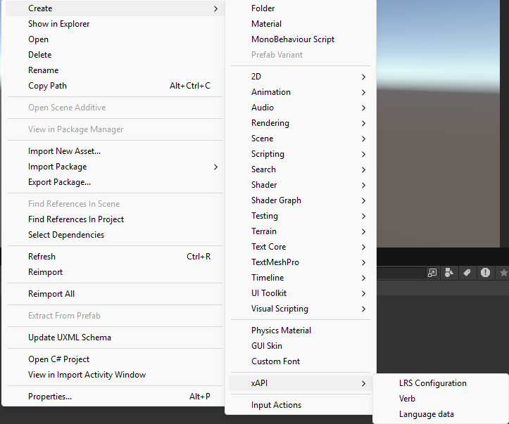
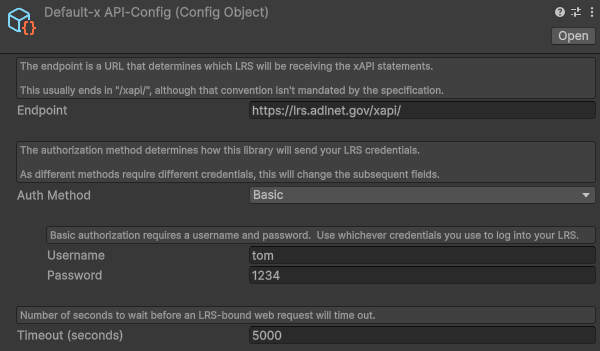
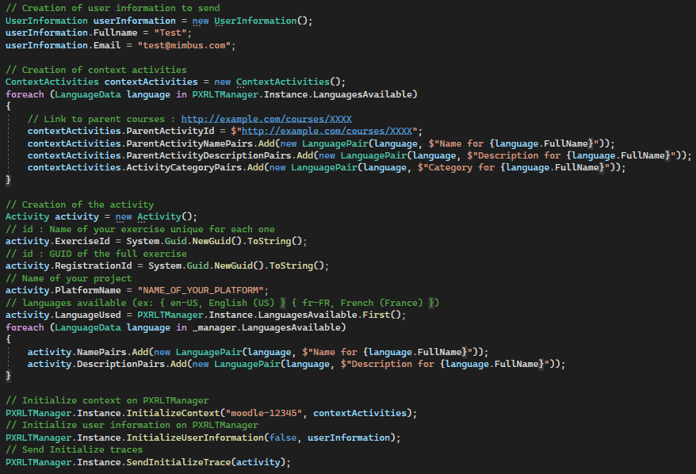
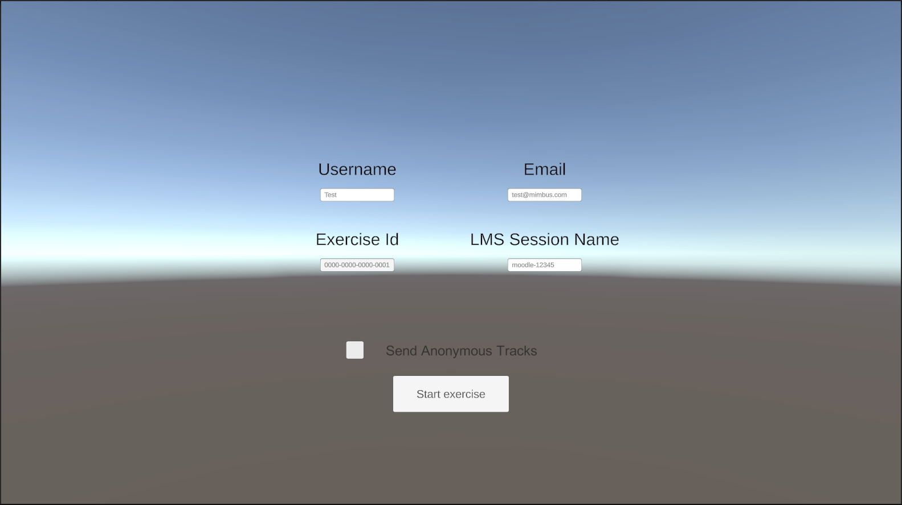
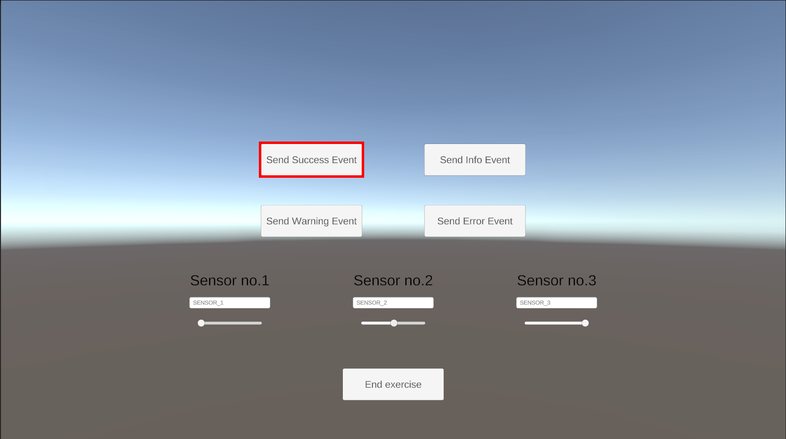
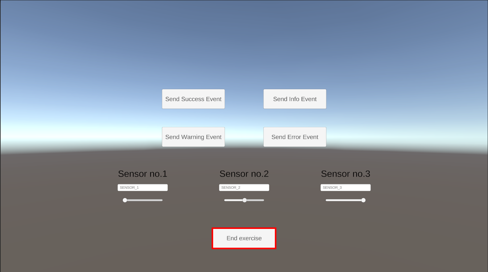

# Learning traces from VR activities BB

This BB contains a Unity package, which help the implementation and creation of learning traces in xAPI format. The main use case, is to track all events from an exercise in a 3D simulation and record it in a LRS.

## Design Document
See the design document [here](docs/design-document.md).

## Building instructions
_Describe how to build the BB._

Download Unity Hub at : [download hub](https://unity.com/download).\
From this launcher download an Unity version (at least 2023.2.x).

**Choose the way you prefer**

* Create your Unity project and import the `PTX_learningTraces.unitypackage` available in the repository in it.\
(You can drag&drop the package in the unity editor to import it)

**or**

* A project on Unity 6000.0.38f1 is already available in the current repository.\
The package is already in it, you can use it as a base for your application.

\
After creating your project, you will have to create a new LRS Configuration in Unity.\


This object will allow you to set your targeted LRS database.\


To finish setup, put the PXRLTManager prefab in "PXRLT/Runtime/Prefabs/" and reference your newly created LRS configuration in it.

## Running instructions
_Describe how to run the BB._

As only running instructions, run unity simulation.

## Example usage
_Describe how to check some basic functionality of the BB._


This example will show how to send a initialized trace in an LRS. 
Language available (English, French, German, Spanish)

* Input



* Output given in your LRS or Unity editor message window
```
{
    "id": "bfdee4d5-7108-4f93-87b3-64b1a2fefe98",
    "actor": {
        "objectType": "Agent",
        "name": "Test",
        "mbox": "mailto:test@mimbus.com"
    },
    "verb": {
        "id": "http://adlnet.gov/expapi/verbs/initialized",
        "display": {
            "es-ES": "inicializó",
            "de-DE": "initialisierte",
            "en-US": "initialized",
            "fr-FR": "a initialisé"
        }
    },
    "context": {
        "extensions": {
            "https://w3id.org/xapi/cmi5/context/extensions/sessionid": "moodle-12345"
        },
        "registration": "f3643fdb-d443-47c7-9bd9-243f09afcf04",
        "language": "en-US",
        "contextActivities": {
            "parent": [
                {
                    "id": "http://example.com/courses/XXXX",
                    "definition": {
                        "name": {
                            "es-ES": "Name for Spanish (Spain)",
                            "de-DE": "Name for German (Germany)",
                            "en-US": "Name for English (US)",
                            "fr-FR": "Name for French (France)"
                        },
                        "description": {
                            "es-ES": "Description for Spanish (Spain)",
                            "de-DE": "Description for German (Germany)",
                            "en-US": "Description for English (US)",
                            "fr-FR": "Description for French (France)"
                        },
                        "type": "http://adlnet.gov/expapi/activities/course"
                    },
                    "objectType": "Activity"
                }
            ],
            "category": [
                {
                    "id": "https://w3id.org/xapi/simulation/v1.0",
                    "definition": {
                        "name": {
                            "es-ES": "Category for Spanish (Spain)",
                            "de-DE": "Category for German (Germany)",
                            "en-US": "Category for English (US)",
                            "fr-FR": "Category for French (France)"
                        },
                        "description": {},
                        "type": "http://id.tincanapi.com/activitytype/category"
                    },
                    "objectType": "Activity"
                }
            ]
        },
        "platform": "NAME_OF_YOUR_PLATFORM"
    },
    "timestamp": "2025-03-12T10:18:31.470Z",
    "stored": "2025-03-12T10:18:31.534Z",
    "authority": {
        "objectType": "Agent",
        "account": {
            "name": "NAME_OF_LRS",
            "homePage": "http://cloud.scorm.com"
        }
    },
    "version": "1.0.0",
    "object": {
        "id": "https://navy.mil/netc/xapi/activities/simulations/0000-0000-0000-0001",
        "definition": {
            "name": {
                "es-ES": "Name for Spanish (Spain)",
                "de-DE": "Name for German (Germany)",
                "en-US": "Name for English (US)",
                "fr-FR": "Name for French (France)"
            },
            "description": {
                "es-ES": "Description for Spanish (Spain)",
                "de-DE": "Description for German (Germany)",
                "en-US": "Description for English (US)",
                "fr-FR": "Description for French (France)"
            },
            "type": "http://adlnet.gov/expapi/activities/simulation"
        },
        "objectType": "Activity"
    }
}
```


## Unit testing
### Setup test environment

In the "PXRLT/SampleTests" folder you can find a unity scene "SimpleScene.unity". _(Open it)_

This test example consists in two menu :
* **Connexion menu** : a menu to choose context field
    * _Username_ : name of the user
    * _Email_ : email address of the user
    * _Exercise ID_ : ID of this specific exercise
    * _Toggle anonymity_ : Check to create anonymous traces
    * _LMS Session Name_ : Name to connect to your LMS session (_it's not mandatory_)

* **Exercise menu** : a menu to send all types of event and result
    * _Success Event_ : Send a success event to a LRS
    * _Information Event_ : Send a information event to a LRS
    * _Warning Event_ : Send a warning event to a LRS
    * _Error Event_ : Send a error event to a LRS
    * _Results sliders_ : Select results for the 3 sensors

To send your result in an LRS you'll need to create a new LRS configuration.\
To do this, go to the project editor window and create a "LRS Configuration" under Create/xAPI/LRS Configuration.

Fill the new LRS Configuration with your LRS information then reference it in the PXRLTManager prefab in the scene.

### Run tests

Start Unity simulation after finishing the setup.\
You'll be able to fill all fields and start an exercise.

Going to the exercise menu, you can do multiples things:
* Send event trace with buttons
* Modify name and value or each sensors
* End exercise

When you end an exercise, you are sent back to the connexion menu where you can go for another batch of traces.

### Expected results

_**Start Exercise**_

Input (_Click on start exercise_)


Output on LRS after clicking on start exercise button
```
{
    "id": "bfdee4d5-7108-4f93-87b3-64b1a2fefe98",
    "actor": {
        "objectType": "Agent",
        "name": "Test",
        "mbox": "mailto:test@mimbus.com"
    },
    "verb": {
        "id": "http://adlnet.gov/expapi/verbs/initialized",
        "display": {
            "es-ES": "inicializó",
            "de-DE": "initialisierte",
            "en-US": "initialized",
            "fr-FR": "a initialisé"
        }
    },
    "context": {
        "extensions": {
            "https://w3id.org/xapi/cmi5/context/extensions/sessionid": "moodle-12345"
        },
        "registration": "f3643fdb-d443-47c7-9bd9-243f09afcf04",
        "language": "en-US",
        "contextActivities": {
            "parent": [
                {
                    "id": "http://example.com/courses/XXXX",
                    "definition": {
                        "name": {
                            "es-ES": "Name for Spanish (Spain)",
                            "de-DE": "Name for German (Germany)",
                            "en-US": "Name for English (US)",
                            "fr-FR": "Name for French (France)"
                        },
                        "description": {
                            "es-ES": "Description for Spanish (Spain)",
                            "de-DE": "Description for German (Germany)",
                            "en-US": "Description for English (US)",
                            "fr-FR": "Description for French (France)"
                        },
                        "type": "http://adlnet.gov/expapi/activities/course"
                    },
                    "objectType": "Activity"
                }
            ],
            "category": [
                {
                    "id": "https://w3id.org/xapi/simulation/v1.0",
                    "definition": {
                        "name": {
                            "es-ES": "Category for Spanish (Spain)",
                            "de-DE": "Category for German (Germany)",
                            "en-US": "Category for English (US)",
                            "fr-FR": "Category for French (France)"
                        },
                        "description": {},
                        "type": "http://id.tincanapi.com/activitytype/category"
                    },
                    "objectType": "Activity"
                }
            ]
        },
        "platform": "NAME_OF_YOUR_PLATFORM"
    },
    "timestamp": "2025-03-12T10:18:31.470Z",
    "stored": "2025-03-12T10:18:31.534Z",
    "authority": {
        "objectType": "Agent",
        "account": {
            "name": "NAME_OF_LRS",
            "homePage": "http://cloud.scorm.com"
        }
    },
    "version": "1.0.0",
    "object": {
        "id": "https://navy.mil/netc/xapi/activities/simulations/0000-0000-0000-0001",
        "definition": {
            "name": {
                "es-ES": "Name for Spanish (Spain)",
                "de-DE": "Name for German (Germany)",
                "en-US": "Name for English (US)",
                "fr-FR": "Name for French (France)"
            },
            "description": {
                "es-ES": "Description for Spanish (Spain)",
                "de-DE": "Description for German (Germany)",
                "en-US": "Description for English (US)",
                "fr-FR": "Description for French (France)"
            },
            "type": "http://adlnet.gov/expapi/activities/simulation"
        },
        "objectType": "Activity"
    }
}
```

_**Send Events**_

Input (_Click on send success event button_)\



Output
```
{
    "id": "0c9fb9c2-6286-4636-a327-81e7d8d2b91c",
    "actor": {
        "objectType": "Agent",
        "name": "Test",
        "mbox": "mailto:test@mimbus.com"
    },
    "verb": {
        "id": "http://adlnet.gov/expapi/verbs/interacted",
        "display": {
            "es-ES": "interactuó",
            "de-DE": "interagierte",
            "en-US": "interacted",
            "fr-FR": "a interagi"
        }
    },
    "result": {
        "extensions": {
            "http://id.tincanapi.com/extension/severity": "success"
        },
        "success": true
    },
    "context": {
        "extensions": {
            "https://w3id.org/xapi/cmi5/context/extensions/sessionid": "moodle-12345"
        },
        "registration": "f3643fdb-d443-47c7-9bd9-243f09afcf04",
        "contextActivities": {
            "parent": [
                {
                    "id": "http://example.com/courses/XXXX",
                    "definition": {
                        "name": {
                            "es-ES": "Name for Spanish (Spain)",
                            "de-DE": "Name for German (Germany)",
                            "en-US": "Name for English (US)",
                            "fr-FR": "Name for French (France)"
                        },
                        "description": {
                            "es-ES": "Description for Spanish (Spain)",
                            "de-DE": "Description for German (Germany)",
                            "en-US": "Description for English (US)",
                            "fr-FR": "Description for French (France)"
                        },
                        "type": "http://adlnet.gov/expapi/activities/course"
                    },
                    "objectType": "Activity"
                }
            ],
            "category": [
                {
                    "id": "https://w3id.org/xapi/simulation/v1.0",
                    "definition": {
                        "name": {
                            "es-ES": "Category for Spanish (Spain)",
                            "de-DE": "Category for German (Germany)",
                            "en-US": "Category for English (US)",
                            "fr-FR": "Category for French (France)"
                        },
                        "description": {},
                        "type": "http://id.tincanapi.com/activitytype/category"
                    },
                    "objectType": "Activity"
                }
            ]
        }
    },
    "timestamp": "2025-03-12T10:18:36.986Z",
    "stored": "2025-03-12T10:18:36.990Z",
    "authority": {
        "objectType": "Agent",
        "account": {
            "name": "NAME_OF_LRS",
            "homePage": "http://cloud.scorm.com"
        }
    },
    "version": "1.0.0",
    "object": {
        "id": "https://navy.mil/netc/xapi/activities/simulations/0000-0000-0000-0001/events/EVENT_SUCCESS",
        "definition": {
            "name": {
                "es-ES": "Event success for Spanish (Spain)",
                "de-DE": "Event success for German (Germany)",
                "en-US": "Event success for English (US)",
                "fr-FR": "Event success for French (France)"
            },
            "description": {},
            "type": "http://adlnet.gov/expapi/activities/interaction"
        },
        "objectType": "Activity"
    }
}
```

_**End Exercise**_

Input (_Click on end exercise_)


Output

```
{
    "id": "40eb493f-0c11-45b0-9dde-fe84a590daea",
    "actor": {
        "objectType": "Agent",
        "name": "Test",
        "mbox": "mailto:test@mimbus.com"
    },
    "verb": {
        "id": "http://adlnet.gov/expapi/verbs/completed",
        "display": {
            "es-ES": "completó",
            "de-DE": "beendete",
            "en-US": "completed",
            "fr-FR": "a terminé"
        }
    },
    "result": {
        "extensions": {
            "https://navy.mil/netc/xapi/activities/simulations/0000-0000-0000-0001/sensors/score": {
                "SENSOR_1": 0,
                "SENSOR_2": 0.5,
                "SENSOR_3": 1
            }
        },
        "score": {
            "scaled": 0.5
        },
        "success": true,
        "completion": true,
        "response": ""
    },
    "context": {
        "extensions": {
            "https://w3id.org/xapi/cmi5/context/extensions/sessionid": "moodle-12345"
        },
        "registration": "f3643fdb-d443-47c7-9bd9-243f09afcf04",
        "contextActivities": {
            "parent": [
                {
                    "id": "http://example.com/courses/XXXX",
                    "definition": {
                        "name": {
                            "es-ES": "Name for Spanish (Spain)",
                            "de-DE": "Name for German (Germany)",
                            "en-US": "Name for English (US)",
                            "fr-FR": "Name for French (France)"
                        },
                        "description": {
                            "es-ES": "Description for Spanish (Spain)",
                            "de-DE": "Description for German (Germany)",
                            "en-US": "Description for English (US)",
                            "fr-FR": "Description for French (France)"
                        },
                        "type": "http://adlnet.gov/expapi/activities/course"
                    },
                    "objectType": "Activity"
                }
            ],
            "category": [
                {
                    "id": "https://w3id.org/xapi/simulation/v1.0",
                    "definition": {
                        "name": {
                            "es-ES": "Category for Spanish (Spain)",
                            "de-DE": "Category for German (Germany)",
                            "en-US": "Category for English (US)",
                            "fr-FR": "Category for French (France)"
                        },
                        "description": {},
                        "type": "http://id.tincanapi.com/activitytype/category"
                    },
                    "objectType": "Activity"
                }
            ]
        }
    },
    "timestamp": "2025-03-12T10:18:38.386Z",
    "stored": "2025-03-12T10:18:38.377Z",
    "authority": {
        "objectType": "Agent",
        "account": {
            "name": "NAME_OF_LRS",
            "homePage": "http://cloud.scorm.com"
        }
    },
    "version": "1.0.0",
    "object": {
        "id": "https://navy.mil/netc/xapi/activities/simulations/0000-0000-0000-0001",
        "definition": {
            "name": {
                "es-ES": "Result for Spanish (Spain)",
                "de-DE": "Result for German (Germany)",
                "en-US": "Result for English (US)",
                "fr-FR": "Result for French (France)"
            },
            "description": {},
            "type": "http://adlnet.gov/expapi/activities/exercise"
        },
        "objectType": "Activity"
    }
}
```

## Component-level testing
### Setup test environment
### Run tests
### Expected results
