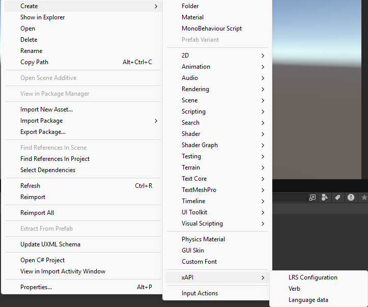
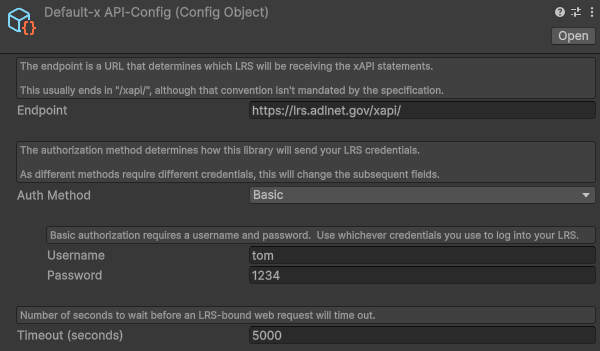
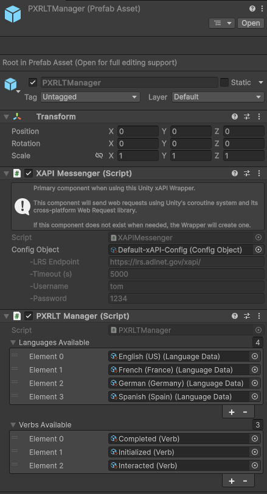

# Technical documentation for Unity package

In this document, you will learn how to use the PTX_learningTraces package.

## Runtime classes

### PXRLTManager

The PXRLTManager is the main manager on this package\
It include the Singleton Pattern, so it accessible with `PackageManager.Instance`.\
This class is the entry point to make all different traces and send them.

| Public methods       | Description       |
|---------------|-------------------|
| ClearContext              | Reset context activity and lms session name |
| ClearUserInformation      | Reset user informations |
| InitializeContext         | Initialize context activity and lms session name, it define the parent activity in case you have a LMS session to link to your activity or/and fill category of the activity |
| InitializeUserInformation | Initialize user informations for next traces. If isAnonymous is true, the email adress will always be equal to `anonymous@domain.com` and userName will be randomly created.|
| SendEventTrace            | Send a trace of event in the targeted LRS |
| SendInitializeTrace       | Send a trace of initialization in the targeted LRS |
| SendResultTrace           | Send a trace of result in the LRS |

| Public variables      | Description       | Accessibilty |
| --------------------- | ----------------- | ------- |
| LanguagesAvailable    | Languages available in the PXRLTManager set previously in editor  | Get only |
| LSMSessionName        | Current LMS session name                                          | Get only |

### LanguageData

This class is a ScriptableObject class, it contains language information.\
_We use ScriptableObject instead of enum to make it scalable_

In this data you'll find the name of a language by RFC-5646 norm and his fullname.

| Public variables      | Description       | Accessibilty |
| --------------------- | ----------------- | ------- |
| FullName    | Fullname of a language ex : English (US)        | Get only |
| Name        | Name of a language based on RFC-5646 ex : es-US | Get only |

### LanguagePair

This class is a serializable version of a pair of LanguageData and a value.

| Public variables      | Description       | Accessibilty |
| --------------------- | ----------------- | ------- |
| Language    | LanguageData instance from ScriptableObject     | Get only |
| Value       | Value pair with languageData                    | Get only |

### ContextActivities

This class is a representation of xAPI.ContextActivities.\
It implement only the specific part we use for VR learning traces.

ContextActivities in xAPI format define a parent Activity like LMS information to link to a LMS courses for example, and the category of our activity.\
In our case we can tell that the category is "VR exercise" or "Simulation exercise".

| Public variables      | Description       | Accessibilty |
| --------------------- | ----------------- | ------- |
| ParentActivityId                  | Parent activity ID                              | Get / Set |
| ParentActivityNamePairs           | Parent activity name by language list           | Get / Set |
| ParentActivityDescriptionPairs    | Parent activity description by language list    | Get / Set |
| ActivityCategoryPairs             | Activity category by language list              | Get / Set |

### UserInformation

This class is a representation of xAPI.Actor.\
It implement only the specific part we use for VR learning traces.

Actor in xAPI format define the type of actor we want to link to our activity, for our use case it will be an Actor created with an email adress and a fullName.

| Public variables      | Description       | Accessibilty |
| --------------------- | ----------------- | ------- |
| Email       | Email of the user        | Get / Set |
| FullName    | Fullname of the user     | Get / Set |

### Activity

This class is a representation of xAPI.Activity.\
It implement only the specific part we use for VR learning traces.

Activity in xAPI format define the nature of our activity, it contains our exercise data like the ID of the exercise, the ID of this instance of the exercise (registration ID), the language used and the platform we use (name of the simulator or application).

| Public variables      | Description       | Accessibilty |
| --------------------- | ----------------- | ------- |
| ExerciseId         | Exercise unique ID                               | Get / Set |
| RegistrationId     | Exercise registration instance ID                | Get / Set |
| PlatformName       | Name of the application or simulation            | Get / Set |
| LanguageUsed       | Language used by the user                        | Get / Set |
| NamePairs          | Activity name by language list                   | Get / Set |
| DescriptionPairs   | Activity description by language list            | Get / Set |

### Result

This class contains score of the user, and a status of why the exercise finished. With this information you can see if the user succeed or not and if he finished, aborted or have a fatal error during the exercise.\
You can also find a list of subresult represented as ResultSensor.   

| Public variables      | Description       | Accessibilty |
| --------------------- | ----------------- | ------- |
| Score              | Score of the exercise                                            | Get / Set |
| ExerciseStatus     | Exercise status (SUCCEED or FAILED)                              | Get / Set |
| ResultStatus       | How exercise finished (FINISHED, ABORTED, FATAL_ERROR)           | Get / Set |
| NamePairs          | Result name by language list                                     | Get / Set |
| DescriptionPairs   | Result description by language list                              | Get / Set |

### ResultSensor

This class contains a key and a float value, it represent subresult in your exercise. Sometimes the global result is not enough to define what the user made so we divide it on subresult call as sensors.

| Public variables      | Description       | Accessibilty |
| --------------------- | ----------------- | ------- |
| Id          | Unique ID of this sensor        | Get only |
| Value       | Score of the sensor              | Get only |

### Event

This class contains event data such has event type and an unique event key which allow us to identify each event from another.

| Public variables      | Description       | Accessibilty |
| --------------------- | ----------------- | ------- |
| Id                    | Unique ID of this event                                         | Get / Set |
| EventStatus           | Event status (SUCCESS, INFO, WARNING, ERROR)                    | Get / Set |
| NamePairs             | Event name by language list                                     | Get / Set |

## Setup

This package need some setup, for you to be able to use it.

### LRS Configuration

To link your LRS to your simulator , you will have to create a `LRS Configuration`.\
It's a ScriptableObject, which you can create by making a right-click on the Project Window and select "Create/xAPI/LRS Configuration".

After creation you'll have to fill this ScriptableObject with the information of your LRS.

\
_This is the default field values you'll have when `LRS Configuration` is create_

### PXRLT Manager prefab

The PXRLTManager prefab, is an object ready to use for basic implementation and use cases.
It implement a PXRLTManager component and a xAPIMessenger, the two main components of this packages.

* xAPIMessenger component contains have a default xAPI config, it will not send your traces on an LRS but you'll be able to start and have unity logs of your traces when sending it.

* PXRLTManager component has 4 languages (english, french, german, spanish) implemented and 3 xAPI verbs (Completed, Initialized, Interacted). 

