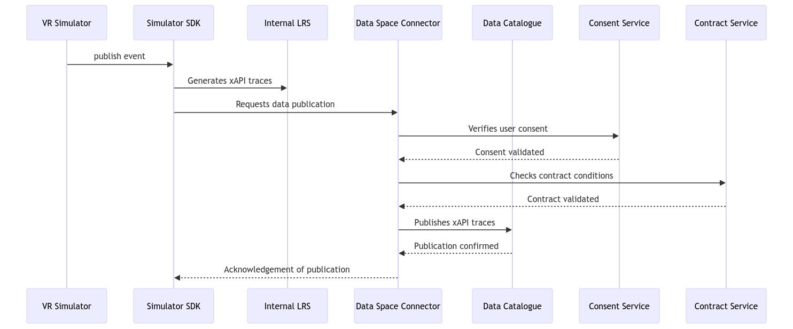

# Learning traces from VR activities BB – Design Document

The "VR Traces" component is designed to capture, record and analyse user interactions with virtual reality (VR) exercises in educational and training contexts. Using the xAPI standard for data structuring, this system enables in-depth analysis of learners' behaviour, successes and difficulties within VR simulations. Key components include the generation of xAPI traces, integration with Learning Record Stores (LRS) for data storage, and analysis tools to interpret the data.Traces are decided by simulator's editor.

## Technical usage scenarios & Features

- xAPI Trace Generation: Automated creation of xAPI traces for every significant interaction within VR environments, providing a detailed record of learner activity.
- Integration with LRS: xAPI traces are sent to a compatible LRS, facilitating secure storage and retrieval of learning data for later analysis.

### Features/main functionalities

- Automated Interaction Capture: Real-time recording of every significant learner action in the VR environment, enabling complete traceability of learning experiences.
- Standardisation of Learning Data: Use of the xAPI standard to format captured data, ensuring interoperability and compatibility with a variety of LRS systems and analytical tools.

* Prioritisation of Events by Severity: Events captured are classified according to their severity (e.g. "info", "warning", "error"), enabling educators to prioritise interventions or feedback according to the urgency or importance of situations encountered by learners.
* Performance details by sensor: specific scores for each evaluation criterion, such as safety (80%) and completion time (95%), providing a detailed view of the learner's strengths and areas for improvement.

##### Value-added

- Understand the skills of a learner in a real-life environment

- To have a micro vision of the movements and interaction of a learner in a simulated environment

- Provides the ability to simulate complex or dangerous scenarios in a safe virtual environment, allowing learners to practice without risk.

### Technical usage scenarios

- Immersive Learning Environments: Enables educators to create immersive learning experiences that enhance learner comprehension.
- Active learning: Engages learners in active learning processes, improving motivation and commitment through interactive experiences.

## Requirements

- **R1. Timeliness**: The system must process and send xAPI traces quickly to ensure a smooth user experience and real-time feedback.

- **R2. Throughput**: The system must be capable of handling a high volume of requests and simultaneous interactions without performance degradation.

- **R3. Scalability**: The system should easily adapt to an increase in the number of users or the complexity of VR simulations without requiring a major redesign.

- **R4. Reliability**: The system should offer high reliability, minimizing failures or errors that could affect learning sessions.

- **R5. Maintainability**: The code and architecture of the system should be designed to facilitate updates, corrections, and the addition of new features.

- **R6. Interoperability**: The system must be compatible with xAPI standards and able to easily integrate with various LRSs and other learning analytics tools.

- **R7. Data Security**: The learning data captured and transmitted by the BB must be secured to protect the confidentiality and integrity of learner information.

- **R8. Anonymity**: The learning data captured and transmitted by the BB should be anonymized.

- **R9. Ease of Use**: The interface and interactions with the BB should be intuitive for end-users, facilitating adoption and efficient use without extensive training.

- **R10. Compatibility**: The BB must be compatible with a wide range of virtual reality technologies and input devices to ensure broad applicability. The traces are standardized.

## Integrations

_See "01_BB Connections" spreadsheet_

### Direct Integrations with Other BBs

### Integrations via Connector

**Integration with consent**

Why?

- User consent to send his traces

What?

- Obtain the user's consent to send his trace

- Obtain person's agreement to share data with selected organizations

**Integration with contract**

Why?

- A contract between the LRS (Learning Record Store) supplier and the user organisation is essential to ensure that learning data is managed in a compliant and secure manner. This makes it possible to :

- Guarantee compliance: ensure that data processing complies with regulatory standards and institutional agreements on privacy and data security.
  Define Access and Processing Rights: Clearly establish the rights and limits relating to access and processing of learning data collected through simulations.

What?

- Determining the Granularity of Authorised Learning Traces: The contract should specify the levels of detail of xAPI traces that can be collected and sent to the LRS. This includes the possibility for learners to choose which type of traces (e.g. info, warning, error) they are willing to share. This approach makes it possible to respect the learner's wish to keep certain information private, such as that relating to errors, while sharing other types of constructive or informative feedback.

- Obtain the Organisation's Agreement: Confirm the organisation's agreement to the export of user metadata to the LRS, ensuring that the organisation has fully consented to this data sharing.

**Integration with identity**

Why?

- Personalising the Learning Experience: Using user identities to personalise their learning journey, delivering a more engaging and effective experience by adapting content and feedback according to their performance and preferences.

What?

- Enable simulator to use users' identities to display metadata such as firstname, lastname, email

## Relevant Standards

### Data Format Standards

The data is in XAPI format. This standard is particularly suitable for tracing events and results.

### Mapping to Data Space Reference Architecture Models

_Mapping to [DSSC](https://dssc.eu/space/DDP/117211137/DSSC+Delivery+Plan+-+Summary+of+assets+publication) or [IDS RAM](https://docs.internationaldataspaces.org/ids-knowledgebase/v/ids-ram-4/)_

[](https://mermaid.live/edit#pako:eNpdT89rgzAU_lfKO1uJWo3msMt6Keth1B3GTKEPjaugSUkjmxP_9yXihDUQ-H7lvS8jlKoSwKBu1Vd5RW02xxOXG3vyputbNEoXKzovzv6lsHdhx1NeHKQRWmLryCI_KylF6Z6Xf2hxXt_eCw4XG7gLada00Vgu7FBZozHDhcP5ocxmu31yBdYms7Au-y_bNg9lZtkWAA86oTtsKvv30YU4mKvoBAdmYSVq7FvDgcvJRrE3Kh9kCczoXnjQ3yo0Yt_gp8YOWI3t3ao3lMBG-AYWBNQPwyyJ4x0lKaFR6MEALEv8LIgTmkaEZgnNgsmDH6XsBOLTHY3DOHVxQoI0msd9zKbbOf0CQIKB1A)

## Input / Output Data

The sample xAPI traces represent a sequence of events in a fibre welding simulation by John Doe, capturing key moments: the beginning, the most significant interactions (classified by severity), and the end. Here is a detailed explanation of each trace, highlighting the exercise ID, the registration ID, and the object IDs to understand how these elements reconstruct Jean Dupont's learning scenario.

The first trace is the initialisation trace, which marks the start of the fibre welding exercise. It contains the following information:

- Actor: Jean Dupont, the learner.
- Verb: "initialized", indicating the start of the exercise.
- Object: The exercise itself, identified by a unique URL which includes the exercise ID (b9e16535-4fc9-4c66-ac87-3ad7ce515f5c), named "fibre welding".
  - Context separation : The specific URL (https://navy.mil/netc/xapi/activities/simulations/) is used to uniquely identify activities taking place in a simulation context. This allows systems processing or analysing xAPI data to immediately understand that the interactions recorded did not occur in the real world, but in a simulated environment. By having a unique identifier for simulations, organisations can separate and manage data generated by simulations differently to data from other types of learning activities. This is particularly useful for analysing performance, evaluating skills acquired in simulation, and comparing with real learning activities. This highlights the importance of distinguishing virtual learning experiences from those carried out in real physical environments.
- Context:
  - Registration: Unique identifier (f47ac10b-58cc-4372-a567-0e02b2c3d479) used as a correlation identifier to link all traces related to this specific exercise attempt by John Doe.
  - Parent: The course associated with this exercise, facilitating contextualisation within the learning application.
  - category element enables traces to be classified according to their technological context. This allows you to quickly identify the type of environment or technology used for the learning experience. Using categories such as "VR Exercise", "Mixed Reality Exercise", "Augmented Reality", etc. helps to distinguish between the different methodologies and technologies used in learning.
  - platform represent the simulator
  - extensions : sessionid is used to associate the interaction with a specific activity in a Learning Management System (LMS), such as Moodle. The value "moodle-activity-12345" uniquely identifies the activity within Moodle, enabling a direct correlation between learning data captured via xAPI and activities structured and managed via the LMS.

```json
{
  "actor": {
    "name": "John Doe",
    "mbox": "mailto:johndoe@example.com"
  },
  "verb": {
    "id": "http://adlnet.gov/expapi/verbs/initialized",
    "display": {
      "en-US": "initialized"
    }
  },
  "object": {
    "id": "https://navy.mil/netc/xapi/activities/simulations/b9e16535-4fc9-4c66-ac87-3ad7ce515f5c",

    "definition": {
      "name": {
        "en-US": "fibre welding"
      },
      "description": {
        "en-US": "Simple exercise about fibre welding"
      },
      "type": "http://adlnet.gov/expapi/activities/simulation"
    }
  },
  "context": {
    "registration": "f47ac10b-58cc-4372-a567-0e02b2c3d479",
    "contextActivities": {
      "parent": [
        {
          "id": "http://mimbus.com/courses/9685",
          "definition": {
            "name": {
              "en-US": "Course fibre welding"
            },
            "description": {
              "en-US": "A course that includes Exercises and lessons about fibre welding"
            },
            "type": "http://adlnet.gov/expapi/activities/course"
          }
        }
      ],
      "category": [
        {
          "id": "https://w3id.org/xapi/simulation/v1.0",
          "definition": {
            "type": "http://id.tincanapi.com/activitytype/category",
            "name": {
              "en-US": "VR Exercises"
            }
          }
        }
      ],
      "extensions": {
        "https://w3id.org/xapi/cmi5/context/extensions/sessionid": "moodle-activity-12345"
      }
    },
    "platform": "Hachette VR",
    "language": "en-US"
  },
  "timestamp": "2024-03-15T09:00:00Z"
}
```

**registration** is a unique identifier assigned to a specific instance of a learning activity or session. This identifier is used to group together all the interactions and events linked to that particular session, enabling consistent and contextualised analysis of the learning data. It can be used to correlate all the actions, decisions and results of a learner within the same learning session.

Summary of this trace is as follows: John Doe(Actor) started (Verb) a fibre welding exercise on 15 March 2024 ( timestamp). This exercise is part of the "Course fibre welding" ( parent) course. The exercise takes place on the "Discover" simulator (platform), in a virtual reality environment (category). A unique identifier (registration) is generated for this exercise, marking the start of this session and also serving as an anchor point for all John's future interactions and assessments within this simulation (Object id).

At the heart of the fibre welding exercise undertaken by Jean Dupont, a series of xAPI traces captures every key moment, enriching our understanding of how the exercise unfolded. Each trace is classified by its nature on the learning experience.

- Error: Some tracks reveal moments of challenge or error, such as a non-straight cut, critical errors that require immediate attention.

- Warning: Other marks bear the word warning, such as a stripping that's too short, signalling areas of caution where Jean is invited to pay particular attention to avoid potential mistakes.

- Info: And then there are captured moments that provide valuable information, such as the correct wearing of Personal Protective Equipment (PPE), affirming the right actions and reinforcing good practice.

- Actor: John Doe, the learner.
- Verb: "interacted", indicating the interaction.
- Object: This is the specific address of the event in the fibre welding exercise, allowing it to be distinguished from other interactions or events. The ID comprises the exercise identifier (b9e16535-4fc9-4c66-ac87-3ad7ce515f5c) followed by a unique event identifier (0221144), providing contextual traceability of the interaction.
  The description provides a more detailed overview of the event, explaining the specific action or context of the interaction. Here, it reveals a specific mistake made by the learner: failing to use the fibre cutter to obtain a perfectly straight cut.
- Context:
  - Registration: Unique identifier (f47ac10b-58cc-4372-a567-0e02b2c3d479) used as a correlation identifier to link all traces related to this specific exercise attempt by John Doe. Each of these traces, whether it signals an error, a warning, or provides information, is linked by the registration correlation identifier.
  - extensions : sessionid is used to associate the interaction with a specific activity in a Learning Management System (LMS), such as Moodle. The value "moodle-activity-12345" uniquely identifies the activity within Moodle, enabling a direct correlation between learning data captured via xAPI and activities structured and managed via the LMS.
- result
  - success : Informs whether the exercise was successful or not
  - extensions : Provides information on the type of event and offers granularity on the action taken. This can be warned for actions requiring attention but remains acceptable, error for actions requiring attention for reasons that invalidate the success of the exercise, the learner is not able to perform this action, Info to give additional information on the context, the action is validated.

```json
{
  "actor": {
    "name": "John Doe",
    "mbox": "mailto:johndoe@example.com"
  },
  "verb": {
    "id": "http://adlnet.gov/expapi/verbs/interacted",
    "display": {
      "en-US": "interacted"
    }
  },
  "object": {
    "id": "https://navy.mil/netc/xapi/activities/simulations/b9e16535-4fc9-4c66-ac87-3ad7ce515f5c/events/0221144",
    "definition": {
      "name": {
        "en-US": "Event in Simulator"
      },
      "description": {
        "en-US": "You did not use the cleaver to get a perfectly straight cut"
      },
      "type": "http://adlnet.gov/expapi/activities/interaction"
    }
  },
  "context": {
    "registration": "f47ac10b-58cc-4372-a567-0e02b2c3d479",
    "extensions": {
      "https://w3id.org/xapi/cmi5/context/extensions/sessionid": "moodle-activity-12345"
    }
  },
  "result": {
    "success": false,
    "extensions": {
      "http://id.tincanapi.com/extension/severity": "error"
    }
  },
  "timestamp": "2024-03-16T22:08:00Z"
}
```

- Actor : The learner
- Verb :"completed": This verb indicates that John Doe has completed the fibre welding exercise.
- Object Fibre Welding Exercise: The object of this interaction, identified by a unique URL, corresponds to the specific exercise within the simulation. The details provided describe the activity and classify the exercise in the appropriate category, here as an exercise within a simulation.
- Result : Score and evaluation: The result indicates an adjusted overall score of 0.75 and confirms the success of the exercise.
  - Extensions provide detailed evaluations on specific criteria such as quality of execution, safety, duration, all sensors include in simulator. These metrics provide a granular view of the learner's skills.
- Context
  This is a reminder of the initial context

Result :

```json
{
  "actor": {
    "name": "John Doe",
    "mbox": "mailto:johnDoe@example.com"
  },
  "verb": {
    "id": "http://adlnet.gov/expapi/verbs/completed",
    "display": {
      "en-US": "completed"
    }
  },
  "object": {
    "id": "https://navy.mil/netc/xapi/activities/simulations/b9e16535-4fc9-4c66-ac87-3ad7ce515f5c",
    "definition": {
      "name": {
        "en-US": "fibre welding"
      },
      "description": {
        "en-US": ""
      },
      "type": "http://adlnet.gov/expapi/activities/exercise"
    }
  },
  "result": {
    "score": {
      "scaled": 0.75
    },
    "success": true,
    "completion": true,
    "response": "The learner completed the fibre welding exercise.",
    "extensions": {
      "http://example.com/exercises/b9e16535-4fc9-4c66-ac87-3ad7ce515f5c/sensors/score": {
        "ExecutionQuality": 0,
        "Safety": 1,
        "Duration": 1,
        "Autonomy": 1,
        "Eco responsability": 0.75
      }
    }
  },
  "context": {
    "registration": "f47ac10b-58cc-4372-a567-0e02b2c3d479",
    "contextActivities": {
      "parent": [
        {
          "id": "http://mimbus.com/courses/9685",
          "definition": {
            "name": {
              "en-US": "Course fibre welding"
            },
            "description": {
              "en-US": "A course that includes Exercises and lessons about fibre welding"
            },
            "type": "http://adlnet.gov/expapi/activities/course"
          }
        }
      ],
      "category": [
        {
          "id": "https://w3id.org/xapi/simulation/v1.0",
          "definition": {
            "type": "http://id.tincanapi.com/activitytype/category",
            "name": {
              "en-US": "VR Exercises"
            }
          }
        }
      ],
      "extensions": {
        "https://w3id.org/xapi/cmi5/context/extensions/sessionid": "moodle-activity-12345"
      }
    },
    "platform": "Hachette VR",
    "language": "en-US"
  },
  "timestamp": "2024-03-16T09:10:00Z"
}
```

<!--- 

## Architecture

TODO

-->

## Dynamic Behaviour



<!--- 

## Configuration and deployment settings

_What configuration options does this BB have?
What is the configuration format?
Provide examples.
How is the component logging the operations? What are the error scenarios? What are the limits in terms of usage (e.g. number of requests, size of dataset, etc.)?_

## Third Party Components & Licenses

\_Does this BB rely on any 3rd-party components?
See also the "EDGE third party/background components" spreadsheet.

## Implementation Details

_This is optional: remove this heading if not needed.
You can add details about implementation plans and lower-level design here._

## OpenAPI Specification

\_In the future: link your OpenAPI spec here.

## Test specification

_Test definitions and testing environment should be availaible, and the tests should be repeatable._

### Test plan

Testing strategy, tools and methods chosen, methods for acceptance criteria.
To be detailed.

### Internal unit tests

_Here specify the test cases for the units inside the BB.  
Candidates for tools that can be used to implement the test cases: JUnit, Mockito, Pytest._

### Component-level testing

_Here specify how to test this component/BB as a whole. This is similar to how other BBs will use this component.  
Candidates for tools that can be used to implement the test cases: K6, Postman, stepci, Pact  
An example tutorial is available [here](https://github.com/ftsrg-edu/swsv-labs/wiki/2b-Integration-testing)._

-->
